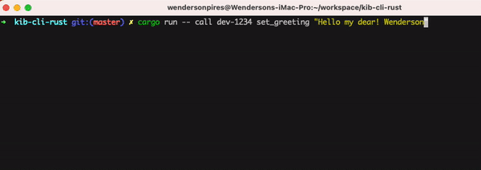

# Greetings Smart Contract (Kibi)

This is a smart contract that runs inside the [Kibi Blockchain](https://github.com/wpdas/kibi-blockchain).

## How to use

- 1 - Go to [Kibi Blockchain repo](https://github.com/wpdas/kibi-blockchain), clone it;
- 2 - Inside the Kibi Blockchain repo/folder, run `cargo run`;
- 3 - Clone this repo;
- 4 - Inside this repo's folder, run one of the commands below:

Persisting a `greeting`:

```sh
# dev-1234 = the contract id
# set_greeting = is a contract's method
# "Hello from Wendz!" = is the string value to be stored on chain under the contract
cargo run -- call dev-1234 set_greeting "Hello from Wendz!"
```

Viewing the current `greeting`:

```sh
# dev-1234 = the contract id
# greeting = is a contract's field
cargo run -- view dev-1234 greeting
```

<p align="left">
  
</p>
